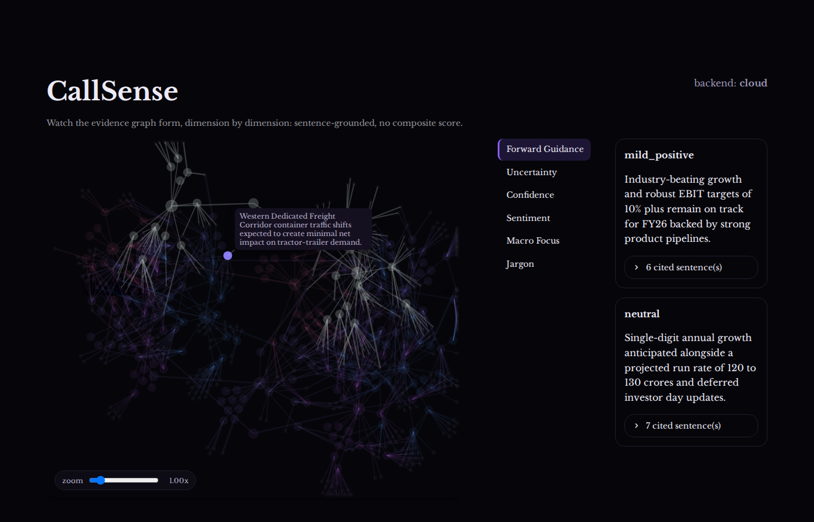
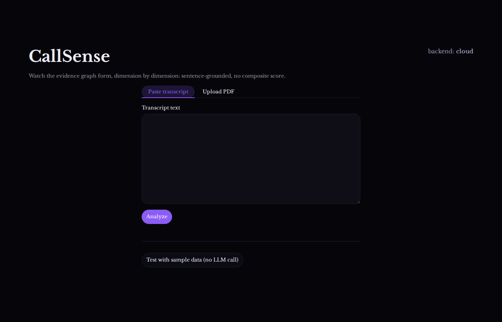

# CallSense

Analyzes earnings call transcripts across six linguistic dimensions drawn from academic research on analyst communication, and shows the reasoning as a live, explorable graph instead of a black-box score. Every conclusion cites specific, located sentences from the transcript. Nothing is asserted without a traceable, weighted path back to the source text.



## What it does

A transcript goes in (pasted text or a PDF upload), and the pipeline:

1. Splits it into sentences, each with a real offset into the source text.
2. Judges every sentence, in small groups, along six dimensions at once: **Forward Guidance, Uncertainty, Confidence, Sentiment, Macro Focus, Jargon**.
3. Recursively summarizes and re-judges those groups' outputs, round after round, until each dimension converges to a handful of final, labeled conclusions.
4. Renders the whole thing as an explorable graph that can be zoomed, panned, dragged, and clicked into, down to the exact sentence a conclusion is built from.

There is no single composite score. An earlier version of this project averaged the six dimensions into one weighted number. Those weights were never validated against anything, and averaging LLM-classified labels manufactures a precision that isn't there. This version keeps every dimension's conclusions separate, grounded, and cited.

## Academic basis

**Matera 2024** ([arXiv:2511.15214](https://arxiv.org/abs/2511.15214)) defines the six dimensions used here.

**"Fast Numbers, Slow Language"** ([arXiv:2606.29734](https://arxiv.org/abs/2606.29734)) informed the discrete five-anchor label scale (`strong_negative`..`strong_positive`) used per conclusion.

## Architecture

### The pipeline: recursive weighted collapse

The core idea is a single signature, "given a small group of inputs, score each one's relevance per dimension and write one grounded summary sentence per dimension," applied recursively:

```
sentences (level 0)
  -> base windows, ~20 sentences each, one call per window     (level 1: composites)
    -> grouped by branching_factor, one call per group          (level 2: composites)
      -> ... repeats until each dimension has <= target composites, marked terminal
```

Every call scores its own inputs' relevance (0-3, normalized to sum to 1 among siblings) and writes the next round's input text, so a model never has to judge an entire transcript at once, only a handful of short passages. Every composite's text stays traceable through the exact chain of weighted edges that produced it. Level 1 is a single shared call across all six dimensions per window (`DimensionCollapse`). From level 2 onward, composites have already diverged per dimension, so one call still covers all six but reads a separate input list per dimension (`DimensionCollapseBundled`). Prompts run through a compact, hand-rolled parser (`modules/raw_collapse_predictor.py`) instead of DSPy's default adapter, measured about 2.5 to 2.9 times faster for the same model and task, since most of the default adapter's output is scaffolding rather than model content.

Everything is written to a SQLite (WAL-mode) graph store as it's produced (`persistence/graph_store.py`), nodes and edges, level by level, so a live viewer can read the graph while the pipeline is still building it, and an interrupted run resumes from the last completed level instead of restarting.

### The graph UI

The graph is a real bidirectional Streamlit component (`ui/graph_component.py`, `ui/graph_frontend/index.html`: plain D3 plus a hand-rolled Streamlit component protocol, no build tooling), not a redraw-on-every-poll `st.components.v1.html` blast. That distinction is what makes the rest of it possible:

- **Mounts once, fully formed.** Analysis itself runs behind a plain progress screen (see below); the graph component only mounts after the run completes, already holding every node and edge, so there's no half-built layout to reason about or jank to hide.
- **Dimension focus is a pure restyle.** Selecting a dimension (vertical tabs, left of the theme cards) dims everything else to near-invisible and dulls the selected dimension's own resting color. Hovering a node lights it up along with its first-order neighbors in that dimension, tracing structure without ever touching the underlying simulation.
- **A synthetic per-dimension hub** (no LLM, purely structural) links every terminal conclusion for a dimension, pulling a dimension's final themes visibly together instead of relying on a soft anchor force alone.
- **A zoom slider mirrors the D3 zoom behavior both ways**: dragging it zooms the graph, and wheel or drag zooming on the canvas updates the slider, no Streamlit rerun involved either direction.
- **Clicking a source sentence** jumps to and highlights its exact span in a transcript panel underneath, auto-scrolled into view.
- Interactive throughout: zoom, pan, drag any node.

### Deterministic attribution for citations

Every edge carries a real relevance weight from the model's own scoring. `analysis/attribution.py`'s `compute_attribution` chains those weights together across every round (a weighted breadth-first walk from each terminal down to its leaves) to compute exactly how much each sentence explains a given conclusion: a real, computable share, not just "cited or not." That's what powers the ranked evidence list under each theme card.

### Analysis screen: a progress log, not a half-built graph

An earlier version streamed the graph live, mid-build, updating the force simulation every second as new levels landed. It looked good in a demo but was fragile in practice: node positions kept jumping as new evidence arrived, and there was nothing gained from watching it half-finished. The analysis screen now shows a plain progress bar and a growing log of what's completed ("Level 2 composed", and so on) until the run is done, then hands off to the fully-formed graph in one step. Once a run completes, its underlying SQLite graph store can be downloaded directly ("Save this run"), the same file the fixture-replay path below reads from.

## Project structure

```
app.py                              Streamlit UI: phases, progress bar, panel, transcript jump
requirements.txt / pyproject.toml   Dependencies
.streamlit/config.toml              Theme (purple-on-black, Libre Baskerville), Streamlit-mandated location
fixtures/
  sample_transcript.txt             A real, full-size earnings call transcript
  sample_run.sqlite                 A completed graph store built from it (see below)
scripts/
  generate_ui_fixture.py            Regenerates fixtures/sample_run.sqlite (spends real LLM calls)
  smoke_test.py                     Manual check that the configured backend is reachable
src/earnings_analyser/
  config.py                         Backend profiles (cloud/local) and DSPy configuration
  pipeline.py                       Wires a live predictor to the collapse orchestration
  report.py                         Builds the {dimension: [themes]} shape the UI consumes
  data/
    sentence_split.py               Deterministic sentence split, overlapping base windows
    pdf_extract.py                  PDF to text extraction
  signatures/
    dimension_collapse.py           The one recurring signature: 6-dimension relevance + summary + (terminal) label
    common.py                       Shared label scale and dimension list
  modules/
    collapse_step.py                One level of the recursion, the orchestration loop, call-count estimation
    raw_collapse_predictor.py       Compact-prompt predictor (bypasses DSPy's default adapter)
  analysis/
    attribution.py                  Pure-code weight computations (no model calls)
  persistence/
    graph_store.py                  SQLite/WAL-backed node/edge store, resumable
  ui/
    graph_component.py              Python side of the bidirectional graph component
    graph_frontend/index.html       The graph itself: D3 and hand-rolled Streamlit component protocol
docs/
  screenshots/                      README images
tests/                              pytest coverage for the deterministic parts
```

## Setup

Requires Python 3.12 and a Google Gemini API key (this project's cloud backend).

```bash
python -m venv .venv
.venv/bin/python -m pip install -r requirements.txt
# or: .venv/bin/python -m pip install -e ".[dev]"   (editable install, plus pytest)
```

Copy `.env.example` to `.env` and fill in:

```bash
GOOGLE_API_KEY=your-gemini-api-key-here
EARNINGS_ANALYSER_BACKEND=cloud
```

A local backend also exists (Ollama, no cloud key required, see `.env.example` and `config.py`'s `BACKEND_PROFILES`), but the cloud profile is what this project is built and tuned around today.

Prefer `.venv/bin/python -m <tool>` over `.venv/bin/<tool>` directly. A venv's console scripts hardcode their creation path in the shebang line, so `.venv/bin/streamlit` (and similar) breaks with "file not found" if the project directory is ever moved or renamed after the venv was created. Invoking through `python -m` avoids that.

## Running the app

```bash
.venv/bin/python -m streamlit run app.py
```

Paste transcript text or upload a PDF, click Analyze, and watch the progress log while it runs. Once complete, pick a dimension from the left-side tabs, use the zoom slider or your scroll wheel to navigate the graph, and click any source sentence to jump to it in the transcript below. A "Save this run" button downloads the completed run's graph store to replay or archive later.

### Trying it without spending API calls

The input screen has a **"Test with sample data (no LLM call)"** button as an alternative to analyzing a real transcript. It replays `fixtures/sample_run.sqlite`, a real, production-size run already completed against `fixtures/sample_transcript.txt`, at the same pace a live run would take. This lets the whole UI get exercised repeatedly without touching a real backend or its rate limit. Regenerate that fixture (after a pipeline change, for example) with:

```bash
.venv/bin/python scripts/generate_ui_fixture.py
```

That script does make real calls against the configured backend. It's the one time this fixture path is meant to.

## Running tests

```bash
.venv/bin/python -m pytest tests/
```

All tests are pure: no network or live model required. They cover sentence-split offset correctness (including window overlap), the graph store's read/write/resumability behavior, the compact-prompt parser's recovery from malformed model output, and the attribution math (single-level weights, multi-level chains, and multi-parent convergence).


